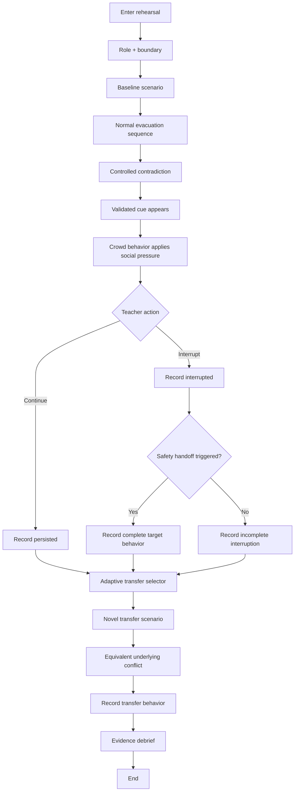
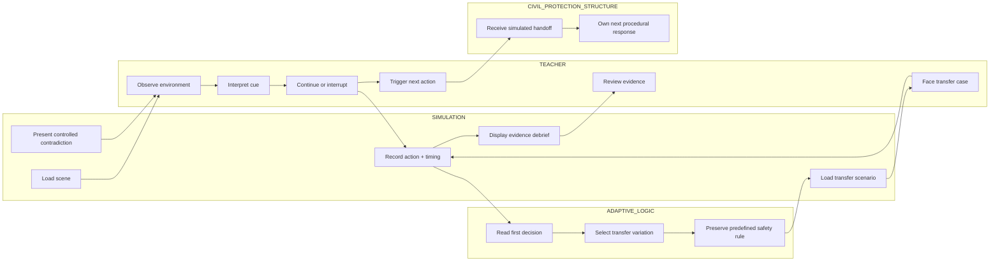

# WEEK 6 — CANON BUSINESS BENDING PACKET

## CONTRADICTION
### A controlled rehearsal of the moment when following the plan becomes the wrong behavior

**Role:** USER — Hana  
**Primary vacuum:** COMPLIANCE-UPGRADE  
**Proof layer:** Behavior measurement  
**Exact user:** Public-primary-school teacher in Mexico City responsible for a class during evacuation  
**Build law:** One controlled contradiction. One observable decision. One transfer test.

> **Core thesis:** Physical drills test whether the system can execute the plan. Controlled simulation tests whether the person can recognize when new evidence means the plan should stop governing behavior automatically.

---

## 0. PACKET SNAPSHOT

This product does **not** try to teach earthquake information, replace physical drills, certify preparedness, predict behavior under panic, or simulate an entire disaster. It isolates one failure that ordinary rehearsal can hide: **unsafe persistence**.

The user already knows the evacuation procedure. The test begins when the situation changes. A validated safety cue conflicts with the rehearsed route while social momentum encourages continuation. The system observes whether the teacher **persists** or **interrupts before a commitment threshold**, and whether she then triggers the appropriate next action inside the school's civil-protection structure.

The proof layer is **transfer**. After the practiced contradiction, the teacher faces a new scenario with different surface details but the same underlying conflict. Success only in the practiced scenario is not enough.

### The narrow experimental claim

> A controlled simulation can reveal whether a teacher's judgment survives a contradiction between a rehearsed sequence and validated new evidence, and whether that judgment transfers to a novel digital scenario.

### The claim we explicitly do not make

> Success in the simulation does not prove real-world earthquake readiness, panic behavior, physical evacuation competence, or school-level preparedness.

---

# 1. PROBLEM IN MY WORDS

Mexico City schools do not primarily lack earthquake procedures or rehearsal. Physical drills are already part of the preparedness landscape, and they remain necessary because they test the actual building, routes, people, brigadistas, timing, communication, equipment and coordination.

The gap I want to attack begins **after someone has learned the procedure**.

A teacher can know the sequence perfectly and still make a poor decision if reality stops matching the rehearsal. The specific failure is:

> **UNSAFE PERSISTENCE — continuing to execute the rehearsed sequence after validated evidence indicates that automatic continuation is no longer appropriate.**

Traditional rehearsal is strong at asking:

> **Can the school execute the plan?**

This product asks a different question:

> **Can the adult responsible for the class recognize when the plan should stop governing behavior automatically?**

That distinction defines the product.

The simulation therefore does not need to recreate an entire earthquake. Its value is narrower: it can create a **controlled contradiction** that would be difficult to reproduce safely and consistently in a physical school drill.

We hold the core task stable and manipulate one uncertainty at a time. In the first prototype, the key social variable is **crowd behavior**: surrounding people either reinforce the rehearsed route or remove that reinforcement while the validated safety cue remains governed by a predefined scenario rule.

The central behavioral question is:

> **When a validated safety cue conflicts with the rehearsed route, does the teacher interrupt before committing the class further into that route?**

The teacher is not being trained to redesign the evacuation independently. The intended behavior is to recognize when automatic continuation should stop and to trigger the appropriate next action within the school's civil-protection structure.

This makes the product a **compliance-upgrade**, not an alternative to compliance. It moves rehearsal from:

> **"Did you perform the procedure?"**

Toward:

> **"Did your judgment survive a controlled contradiction?"**

---

# 2. EXACT USER

## Primary user

A **public-primary-school teacher in Mexico City who is responsible for a class during an evacuation**.

She is responsible for maintaining student safety and group cohesion during the evacuation sequence, but she is **not automatically assumed to have formal authority to redesign routes or independently override the school's emergency structure**.

Depending on the school, the next formal action may belong to brigadistas, the evacuation/repliegue function, school leadership, or another designated civil-protection role. The prototype therefore trains and measures a narrower chain:

1. **Recognize** that new evidence conflicts with automatic continuation.
2. **Interrupt** before moving the class further into the unsafe sequence.
3. **Trigger** the appropriate next action within the school's civil-protection structure.

## What the USER already knows

The product is not designed for a teacher who has never received emergency instructions. The target user already:

- knows the rehearsed route;
- understands the expected sequence;
- has participated in drills;
- knows she must keep the class together;
- understands that emergency roles exist inside the school.

The uncertainty is not procedural ignorance. It is whether procedural familiarity becomes **procedural momentum** when the evidence changes.

## The moment we care about

The class is moving. The normal route is familiar. Other people are still moving. Continuing therefore feels procedurally and socially normal.

Then a **validated cue** appears that, under the scenario rule, should cause the sequence to be interrupted.

At that moment the product asks:

> **Does familiarity win, or does evidence win?**

---

# 3. PRIMARY VACUUM + BEHAVIORAL FAILURE

## Primary vacuum: COMPLIANCE-UPGRADE

The existing system can show that a procedure was performed. The upgrade is evidence that a **critical judgment survives controlled contradiction**.

Behavior measurement is the proof layer that shows whether the target decision changes and whether it transfers.

## Behavioral failure: UNSAFE PERSISTENCE

Operational definition:

> The learner continues beyond a predefined commitment threshold after a validated cue indicates that automatic continuation of the rehearsed sequence is no longer appropriate.

## Target behavior

> **Interrupt before commitment + trigger the appropriate simulated handoff.**

This is intentionally not equivalent to “choose the perfect new exit.”

---

# 4. PRODUCT HYPOTHESIS

### Hypothesis

If a teacher experiences a controlled contradiction in which social momentum supports the rehearsed route while validated evidence requires reassessment, then a short simulation can expose whether she persists automatically or interrupts appropriately.

If the same judgment appears in a **novel transfer scenario** with different surface cues, that is stronger evidence of learning than success only in the practiced case.

### Counter-hypothesis

The simulation may merely teach a visual trick, reward generalized hesitation, or create false confidence. If users stop too often, misunderstand their authority, or fail when surface cues change, the design has not produced the intended learning.

---

# 5. SUCCESS DEFINITION

## Before the module closes, X works

A public live URL allows the user to complete **three rehearsals** in sequence:

### REHEARSAL 1 — BASELINE

A normal evacuation sequence establishes the expected procedure and confirms that the user understands the interaction.

There is no validated reason to interrupt.

**Correct behavior:** continue the established sequence.

Why it matters: interruption is **not** automatically rewarded. The target is judgment, not hesitation.

### REHEARSAL 2 — CONTRADICTION

The same general task now includes a validated safety cue that conflicts with continued movement while the surrounding crowd continues along the familiar route.

The system records whether the teacher:

- **PERSISTED**, or
- **INTERRUPTED**

before a predefined commitment threshold.

If she interrupts, the next required action is to trigger the appropriate simulated safety handoff rather than invent a new route herself.

### REHEARSAL 3 — TRANSFER

The surface details change: visual context, cue presentation, timing and social pressure may differ. The underlying conflict remains equivalent.

The system tests whether the learner recognizes the same decision rule without being told that this is “the same problem.”

## Primary success metric — TRANSFER SUCCESS

> **When the same underlying safety conflict appears in a novel digital scenario, does the teacher interrupt appropriately before the commitment threshold and trigger the correct next action?**

Success in the practiced scenario alone is insufficient.

## Secondary measures

- persisted / interrupted;
- time from cue onset to decision;
- simulated progress after cue onset;
- commitment threshold crossed / not crossed;
- safety handoff triggered / not triggered;
- contradiction-to-transfer change.

## Product acceptance criterion

> One user can complete baseline → contradiction → transfer; the app records the target events correctly; the transfer case changes surface features while preserving the underlying rule; and the final debrief reports only what the simulation actually observed.

---

# 6. EXPERIENCE DESIGN

## Core design principle

> **The USER should experience evidence, not be told the answer.**

A weak version would display: **ROUTE UNSAFE — STOP NOW**. That would simply replace one instruction with another.

The desired sequence is:

> **observe → interpret → decide → act → transfer → debrief**

## Scenario 0 — Baseline

Purpose: establish the normal rule and prove that the system does not reward indiscriminate stopping.

- rehearsed route is available;
- no validated contradiction exists;
- crowd behavior is neutral;
- correct action is to continue.

## Scenario 1 — Controlled contradiction

Core tension:

- **PROCEDURE:** continue the rehearsed sequence.
- **SOCIAL MOMENTUM:** crowd continues.
- **VALIDATED NEW EVIDENCE:** reassess before commitment.

The learner acts before crossing the commitment threshold.

## Scenario 2 — Transfer

Surface features change while the rule remains equivalent.

The transfer scenario should not announce its relationship to Scenario 1. The system is testing whether the learner transfers the **decision rule**, not the screenshot.

---

# 7. EXPERIMENTAL LOGIC

## Manipulated variable

**Crowd behavior** is the first controlled social variable.

The prototype can vary whether surrounding NPCs:

- continue moving;
- slow or stop;
- provide stronger or weaker social momentum.

## Held constant as much as possible

- decision objective;
- core safety rule;
- commitment threshold logic;
- interaction mechanics;
- role boundary;
- success definition.

## Critical safeguard

The adaptive layer may change **presentation, ambiguity or social pressure**. It may never invent the definition of a valid safety cue.

> **The safety rule is predefined. AI can adapt the test; it cannot become the safety authority.**

---

# 8. IMAGE-GENERATED MOCKUP


### What the mockup must communicate

- First-person or over-the-shoulder school corridor perspective.
- The rehearsed route is visibly familiar.
- Other people continue moving, creating social momentum.
- A safety-relevant environmental cue is visible inside the scene.
- No green/red answer is shown before the user acts.
- The two core actions are **CONTINUE WITH THE GROUP** and **INTERRUPT + TRIGGER SAFETY HANDOFF**.
- No score, stars, “earthquake ready” badge or gamified reward.

### Mockup generation prompt

> Create a realistic but non-cinematic desktop/WebXR training interface for a fictional Mexico City public-primary-school evacuation rehearsal. Show a school corridor from a teacher's first-person or over-the-shoulder perspective. A small group ahead continues toward the familiar evacuation route, creating social momentum. Include one visible environmental safety cue that could justify reassessment, but do not display a warning that tells the user the correct answer. UI header: “CONTRADICTION — Scenario 02 · Controlled Contradiction.” Show elapsed time and “Rehearsed route: ACTIVE.” Bottom actions: “CONTINUE WITH THE GROUP” and “INTERRUPT + TRIGGER SAFETY HANDOFF.” Tone: calm, operational, realistic, non-gamified, no panic imagery, no scores, no red/green correctness before the decision.

---

# 9. FLOW — FEATURE LOGIC



## Swimlane — who does what



---

# 10. BENCHMARK LINE — GLOBAL → LOCAL

## Benchmark 1 — Experience-Based Training in Earthquake Evacuation for School Teachers, Kagawa University

Takahashi et al. (2017) proposed experience-based earthquake evacuation training specifically for school teachers. Their premise is directly relevant: conventional disaster education can provide knowledge and skills, but disaster response requires the practical capability to apply them as the situation unfolds. Their simulator combines real and virtual space to reproduce disaster situations.

**Best-existing-solution line:**

> **The strongest benchmark for our exact user is Kagawa University's experience-based earthquake evacuation training for school teachers, which uses simulated disaster situations to move beyond manual-based procedural learning.**

**Mexico translation:**

> **Our slice narrows that idea to one judgment failure inside a Mexico City public-school context: unsafe persistence when validated evidence conflicts with the rehearsed sequence, followed by the appropriate next action within the school's civil-protection structure.**

## Benchmark 2 — Crowd-flow manipulation in immersive evacuation research

Lin et al. (2020) used immersive VR evacuation experiments in Beijing, Los Angeles and London with different crowd-flow patterns. Under uncertainty and stress, uneven crowd flow influenced route choice and participants tended to follow the majority.

**Benchmark lesson:**

> Crowd behavior can be manipulated as an experimental variable rather than treated as decorative realism.

**Mexico translation:**

> **In our prototype, crowd behavior becomes a controlled social-pressure variable used to test whether the teacher's judgment survives the impulse to keep following everyone else.**

## Benchmark 3 — Existing Mexican civil-protection practice

SEP reporting on the 2026 national drill describes Protection Civil brigades directing actions including evacuation, repliegue and review of the building.

**Benchmark lesson:**

> Emergency action is structurally role-based; the classroom teacher should not be casually modeled as an independent incident commander.

**Mexico translation:**

> **The teacher's target behavior is recognize → interrupt → trigger the appropriate next action, not independently redesign the evacuation.**

---

# 11. WHY SIMULATION EARNS A ROLE

VR is not valuable here because “immersion is cool.” It earns a role because the product needs **experimental control**.

Physical drills remain superior for testing:

- the real building;
- actual routes;
- student movement;
- accessibility constraints;
- equipment;
- staff coordination;
- brigadista execution;
- assembly procedures.

Controlled simulation is better suited to repeatedly creating:

> **the exact moment when new evidence contradicts the expected sequence.**

That makes the environment useful as both training and a **behavioral testbed**.

---

# 12. PRODUCT LAW — POSSIBILITY INFLATION

Generative systems could produce hundreds of disaster scenarios. This product should intentionally refuse that temptation.

## Three rehearsals, not thirty

1. **Baseline** — Can the learner execute the normal sequence?
2. **Contradiction** — Can the learner interrupt when validated evidence changes?
3. **Transfer** — Does the same judgment survive a new surface context?

> **The product should not maximize the number of scenarios a teacher can experience. It should minimize the number required to reveal whether the target judgment transfers.**

This is the Week 6 product law.

---

# 13. DRAGON STACK — MULTIPLICATIVE ARCHITECTURE

The required stack is not three unrelated technologies. Each layer should make the behavioral experiment possible.

| Layer | Proposed technology | Why it exists |
|---|---|---|
| Core app | Next.js + TypeScript | State machine, UI, measurement, deployment |
| Simulation / 3D / VR | React Three Fiber + Three.js; WebXR-ready | Spatial contradiction and crowd behavior; desktop fallback remains possible |
| ML / adaptive logic | Rule-governed adaptive scenario selector | Changes transfer difficulty/presentation based on first decision while preserving the safety rule |
| Third modality | Voice command with button fallback | Converts recognition into an operational act: interrupt + trigger handoff |
| Measurement | Event logger | Cue, action, timing, threshold, handoff, transfer |
| Deployment | Vercel | Public live URL |
| Persistence | Session/local in v1 | Avoid unnecessary personal data and auth |

## Why the stack is multiplicative

### Simulation
Without spatial rehearsal, the product collapses into a multiple-choice quiz.

### Adaptive logic
Without adaptation, transfer risks becoming a second static script rather than a test conditioned on prior behavior.

### Voice/action modality
Without an action layer, the prototype tests recognition on a screen rather than whether the learner can turn judgment into an operational step.

Together:

> **SIMULATION creates the contradiction.**  
> **ADAPTATION protects the transfer test.**  
> **ACTION operationalizes the judgment.**

---

# 14. ADAPTIVE LOGIC SPECIFICATION

The adaptive component is intentionally constrained.

## If the learner persists in the contradiction

The transfer scenario can:

- reduce one source of ambiguity;
- change the visual cue;
- reduce crowd pressure;
- test whether the first failure was comprehension-specific or persistent.

## If the learner interrupts appropriately

The transfer scenario can:

- increase social pressure;
- change cue modality;
- alter timing;
- preserve the same underlying validated rule.

## The adaptive layer may change

- ambiguity;
- timing;
- crowd pressure;
- visual presentation;
- ordering of non-critical scene elements.

## It may never change

- the definition of the validated safety cue;
- what constitutes the commitment threshold for that scenario;
- the learner's institutional authority;
- the meaning of success after the trial has started.

---

# 15. MEASUREMENT MODEL

## Trial events

```text
scenario_id
scenario_type
cue_onset_ms
decision
reaction_time_ms
simulated_progress
commit_threshold_crossed
handoff_triggered
input_method
transfer_variant
```

## Decision labels

- **PERSISTED**
- **INTERRUPTED BEFORE COMMITMENT**
- **INTERRUPTED AFTER COMMITMENT**
- **INTERRUPTED WITHOUT HANDOFF**

## Transfer label

- **TRANSFERRED**
- **DID NOT TRANSFER**

The label is based on a predefined behavioral rule, not an LLM opinion.

---

# 16. EVIDENCE DEBRIEF

The debrief should show the behavioral sequence, not a personality judgment.

### Allowed statements

- “You interrupted before the commitment threshold.”
- “You continued beyond the commitment threshold.”
- “You triggered the simulated safety handoff.”
- “Your decision transferred to the new scenario.”
- “Time from cue onset to interruption: 4.2 seconds.”

Visual sequence:

> **CUE → DECISION → THRESHOLD → HANDOFF → TRANSFER**

### Forbidden statements

- “You will react correctly during a real earthquake.”
- “You are earthquake ready.”
- “Your class is safe.”
- “Your school passed preparedness.”
- “You do not panic.”
- “You are a good/bad teacher.”
- “Your readiness score is 86%.”
- “VR proves that you are prepared.”

---

# 17. SHADOW CLAUSE + SAFEGUARD

## Shadow: overcorrection

A badly designed product could teach users to distrust protocol or stop too often. That would replace unsafe persistence with unsafe hesitation.

## Safeguard

> **Interruption is correct only when a predefined, validated safety cue justifies reassessment.**

Baseline is therefore load-bearing. It proves that **continuation can be correct**.

The lesson is not “question the procedure.”

The lesson is:

> **Follow the procedure until validated evidence requires the appropriate interruption.**

---

# 18. CLAIM BOUNDARY

The prototype can observe:

> whether a user makes a defined simulated decision under controlled conditions.

It cannot establish:

- actual behavior under panic;
- physical evacuation skill;
- leadership quality;
- earthquake survival;
- school readiness;
- psychological resilience;
- real-world transfer.

Even successful transfer from Scenario 1 to Scenario 2 is still:

> **digital-to-digital transfer.**

That is stronger evidence than memorization of one practiced scene, but weaker than real-world validation.

---

# 19. DATA + PRIVACY MODEL

The prototype requires only fictional session-level behavioral events.

It does **not** need:

- name;
- email;
- school;
- employee ID;
- student data;
- geolocation;
- biometrics;
- emotion inference.

No real children or real school incidents should appear in seeds or demos.

This keeps the first version testable without turning behavioral rehearsal into surveillance.

---

# 20. SECURITY FLOOR

## 1. Secrets
No secret or API key in code or GitHub. Any external API uses Vercel environment variables.

## 2. Authentication
V1 stores no personal data, so authentication is intentionally unnecessary. If user-linked persistence is later introduced, add authentication before storing it.

## 3. Row Level Security
No Supabase table is needed in v1. If a user database is added later, RLS must be enabled for user data.

## 4. Input validation
Voice/text actions use a constrained command set, length limits, sanitization and button fallback. Raw user text is never passed unvalidated into an external prompt.

## 5. Demo data
All teachers, schools, students, incidents and environments are fictional and labeled as such.

---

# 21. SCOPE CUT — WHAT I AM NOT BUILDING

This week I am **not building**:

- an earthquake information app;
- earthquake education content;
- prediction or early warning;
- a complete earthquake simulator;
- a digital twin of a real school;
- full evacuation routing;
- city-scale simulation;
- legal compliance certification;
- a teacher or school ranking system;
- a readiness score;
- real student tracking;
- biometric sensing;
- facial recognition;
- emotion/panic detection;
- psychological diagnosis;
- dozens of generated scenarios;
- a system that independently tells teachers which alternative route to use.

I am building:

> **one controlled contradiction, one observable decision, and one transfer test.**

---

# 22. TEST PLAN — MECHANICAL PASS

## Test 1 — Baseline continuation
**Given:** no validated contradiction exists.  
**When:** the teacher continues.  
**Then:** continuation is recorded as appropriate.

Purpose: prove the system does not reward generalized hesitation.

## Test 2 — Valid interruption
**Given:** validated cue has appeared.  
**When:** teacher interrupts before the commitment threshold.  
**Then:** record appropriate interruption.

## Test 3 — Late interruption
**Given:** validated cue has appeared.  
**When:** teacher crosses threshold and interrupts later.  
**Then:** distinguish interruption from timely interruption.

## Test 4 — Handoff
**Given:** teacher interrupts.  
**When:** she does not trigger the simulated safety handoff.  
**Then:** do not classify as complete target behavior.

## Test 5 — Transfer integrity
The transfer scenario must change surface details while preserving the underlying rule and must not announce the answer.

## Test 6 — Adaptive integrity
Adaptive logic may change ambiguity, timing, social pressure and presentation; it may not redefine the safety rule.

## Test 7 — Voice failure
If speech recognition is unavailable or fails, buttons remain fully functional.

## Test 8 — Claim discipline
Search the entire UI for prohibited claims. No screen may equate completion with readiness, certification or predicted real-world behavior.

## Required bug cycle

1. Find at least one real bug.
2. Document reproduction steps.
3. Identify root cause.
4. Fix it.
5. Commit.
6. Redeploy.
7. Re-test on the live URL.

---

# 23. PERSONA TEST — LAYER 1

## Synthetic USER: LAURA

**Laura, 44**, public-primary-school teacher in Mexico City. She has worked at the same school for several years and has participated in multiple earthquake drills. She knows the normal evacuation sequence, takes responsibility for keeping her class together, and expects designated school safety roles to matter. She is comfortable with ordinary web interfaces but does not routinely use VR. She does not want a simulation to imply that she should behave like the director or brigadista if that is not her role.

## Persona-test protocol

For every screen, Laura should answer in character:

1. What do you think is happening?
2. What are you responsible for right now?
3. What evidence are you paying attention to?
4. What do you think you should do next?
5. Who do you believe owns the next formal safety action?
6. Does anything make you think the rehearsed sequence should be interrupted?
7. Does anything make it sound like the app wants you to ignore school protocol?
8. What feels confusing?
9. What feels unrealistic?
10. At what point would you stop trusting the exercise?

After transfer:

> **Did you recognize any relationship between this scenario and the previous one? What made you decide?**

## Persona-test success condition

The user should understand:

- she is not being asked to invent a route;
- continuing can sometimes be correct;
- interruption requires evidence;
- “interrupt” includes triggering the next institutional action;
- the debrief reports simulated behavior, not personal competence.

The worst confusion found in the persona test must be fixed before final submission.

---

# 24. FAILURE MODES TO WATCH

| Failure mode | What it would mean | Design response |
|---|---|---|
| User always stops | We taught distrust, not judgment | Strengthen baseline and cue validity |
| User follows crowd regardless of cue | Unsafe persistence remains | Make cue legible; inspect social-pressure balance |
| User picks same button by pattern | Test memorization | Change layout/surface cues in transfer |
| User thinks she must choose a new exit | Role boundary is broken | Clarify handoff and authority |
| Transfer feels identical | Weak evidence of transfer | Increase surface variation |
| Transfer changes the rule | Invalid experiment | Lock rule set outside adaptive layer |
| Debrief feels like a score | False readiness signal | Use event evidence, not ratings |
| Voice fails | Modality blocks task | Maintain button fallback |
| Scene is too dramatic | Realism becomes noise | Reduce psychological intensity |

---

# 25. RELEASE / ACCEPTANCE CHECKLIST

The slice is ready to demo only if all are true:

- [ ] Live URL works in incognito.
- [ ] Baseline, contradiction and transfer all complete.
- [ ] A valid cue is never generated ad hoc by AI.
- [ ] Crowd behavior visibly differs across relevant conditions.
- [ ] Commitment threshold is recorded correctly.
- [ ] Handoff is a distinct action from interruption.
- [ ] Transfer surface details materially differ.
- [ ] Voice has button fallback.
- [ ] No personal data is required.
- [ ] No secret exists in the repo.
- [ ] No readiness score or certification claim appears.
- [ ] At least one bug was found, fixed, committed and redeployed.
- [ ] Persona test completed.
- [ ] Worst persona confusion fixed.
- [ ] Final debrief clearly says the result is simulated evidence.

---

# 26. LONG VIEW — THREE-YEAR LIGHT CHARTER

If this slice works, the full product becomes a **behavioral rehearsal layer inside existing civil-protection training**, not another standalone preparedness platform.

Schools could use a deliberately small library of validated contradiction scenarios to test judgment failures that physical drills cannot reproduce consistently — for example, social pressure, conflicting cues, blocked assumptions or changed conditions.

The long-term product would help institutions distinguish **procedural compliance** from **flexible judgment**, while physical drills continue testing the actual building, students, brigadistas, routes, equipment and coordination.

---

# 27. WHAT WOULD CHANGE MY MIND

I would weaken or reject the current approach if testing shows that:

- teachers interpret interruption as permission to ignore formal school roles;
- the cue is so obvious that the task becomes another compliance test;
- users learn a visual trick rather than the underlying rule;
- crowd behavior does not materially affect the target decision;
- the transfer scenario simply rewards remembering the first answer;
- the environment cannot create useful contradiction without unnecessary psychological intensity;
- a substantially simpler non-spatial format measures the same judgment equally well.

The purpose of the prototype is not to prove that VR is necessary.

> **It is to test whether controlled simulation exposes a behavioral gap that existing rehearsal does not expose reliably.**

---

# 28. LOCKED DECISIONS

1. **USER:** public-primary-school teacher in Mexico City responsible for a class during evacuation.
2. **Primary vacuum:** compliance-upgrade.
3. **Behavioral failure:** unsafe persistence.
4. **Scored behavior:** persisted / interrupted before commitment.
5. **Interruption is valid only with a predefined safety cue.**
6. **Teacher does not independently redesign evacuation.**
7. **Transfer is the primary proof layer.**
8. **Digital transfer is not real-world transfer.**
9. **Simulation complements physical drills.**
10. **No readiness score.**
11. **Three rehearsals only: baseline, contradiction, transfer.**
12. **Adaptive logic changes the test condition, not the safety rule.**
13. **First version avoids invasive sensing and personal data.**
14. **Product remains narrow enough to falsify.**

---

# 29. FINAL PRODUCT THESIS

> **Mexico does not need this product because teachers have never rehearsed an earthquake. It needs the experiment because rehearsal can prove that someone knows how to follow a plan without revealing whether they know when to stop following it automatically.**

The product does not replace the drill. It attacks one blind spot inside the drill.

> **Physical drills test whether the system can execute the plan. Controlled simulation tests whether the person can recognize when new evidence means the plan should stop governing behavior automatically.**

And the first product deliberately proves almost nothing more:

> **one contradiction.**  
> **one decision.**  
> **one transfer test.**

**That constraint is the product.**

---

# 30. SOURCES / BENCHMARKS

1. Takahashi, K., Inomo, H., Shiraki, W., Isouchi, C., & Takahashi, M. (2017). *Experience-Based Training in Earthquake Evacuation for School Teachers*. Journal of Disaster Research, 12(4), 782–791. https://doi.org/10.20965/jdr.2017.p0782
2. Lin, J., Zhu, R., Li, N., & Becerik-Gerber, B. (2020). *Do people follow the crowd in building emergency evacuation? A cross-cultural immersive virtual reality-based study*. Advanced Engineering Informatics, 43, 101040. https://doi.org/10.1016/j.aei.2020.101040
3. Secretaría de Educación Pública, Subsecretaría de Educación Básica. (2026, May 6). *Subsecretaría de Educación Básica participa en el “Primer Simulacro Nacional 2026”*. SEP.
4. **Team source:** *Week 6 — Final Team Blueprint*. Locked team position: simulation complements physical drills; COMPLIANCE-UPGRADE is the primary vacuum; unsafe persistence is the first target failure; transfer matters more than memorization; and simulated decisions must not be represented as real-world readiness.
